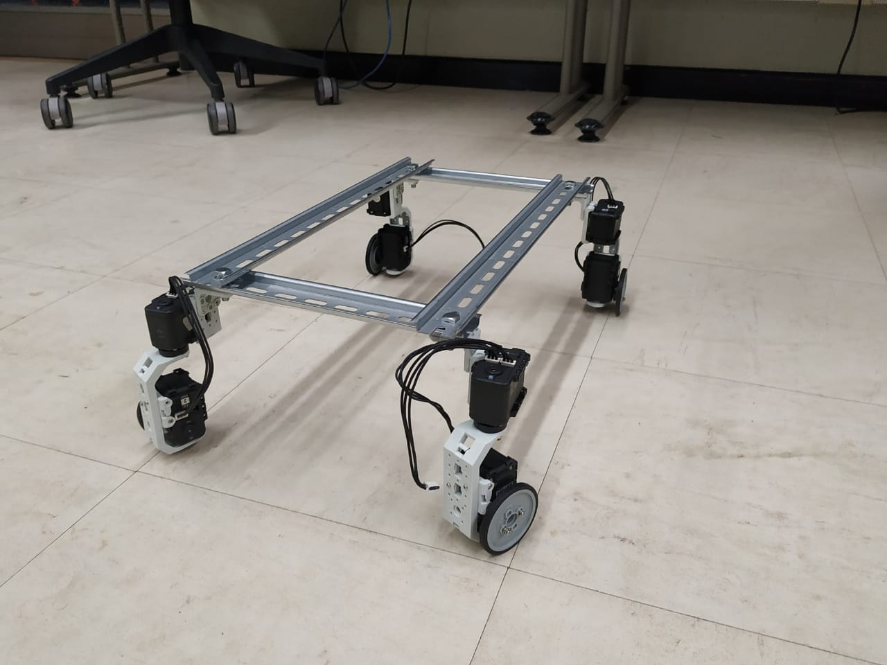
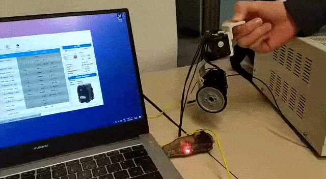
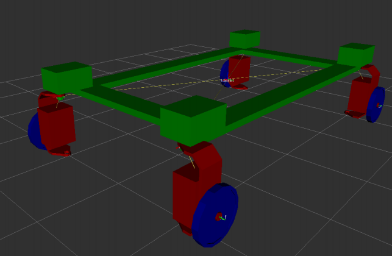
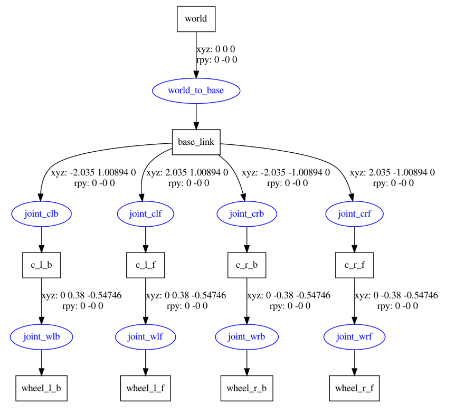
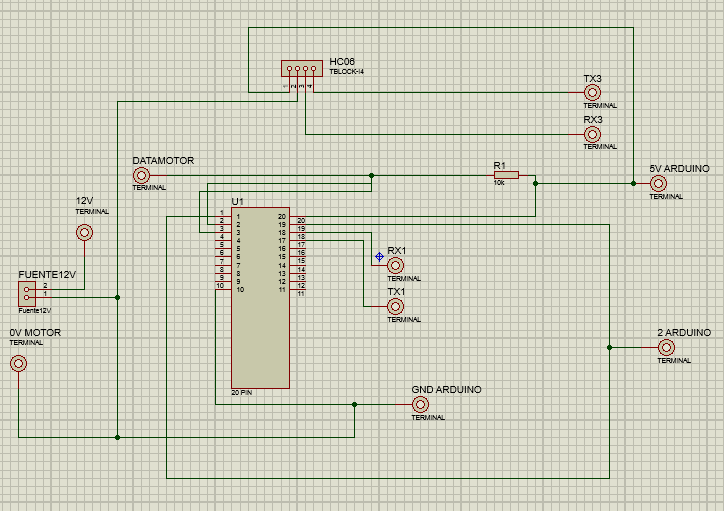
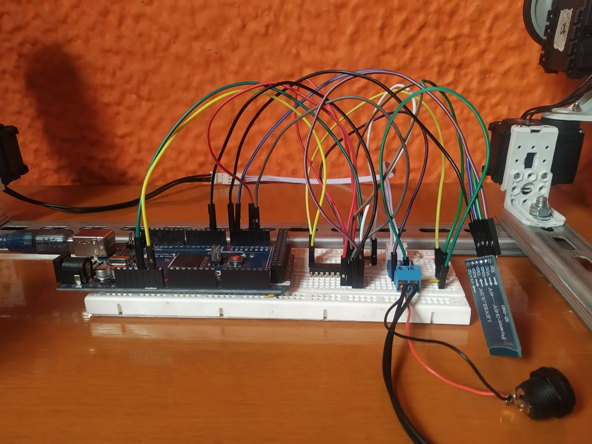
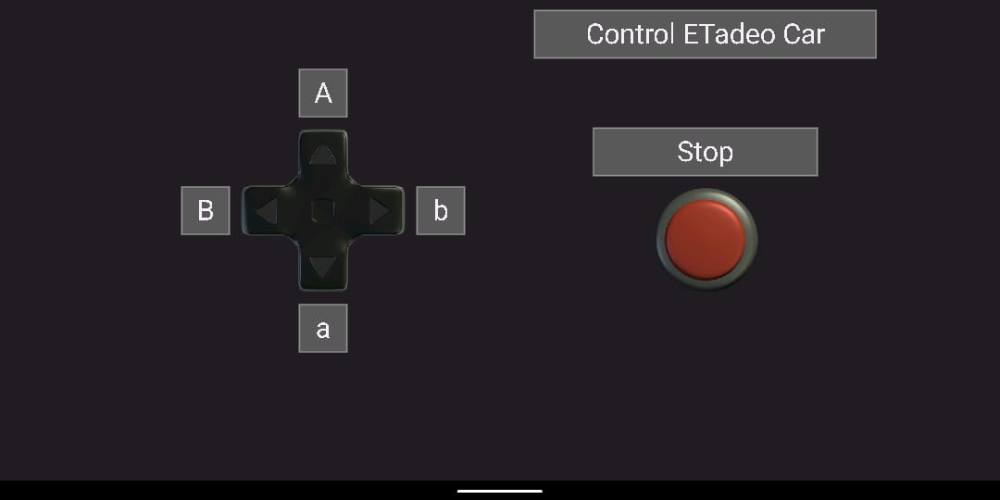

# Tadeo Car
## Robótica industrial
Con este proyecto se busca diseñar a escala el vehículo eléctrico proyecto ETadeo Car, realizado por la universidad de Bogotá Jorge Tadeo Lozano. Este vehículo corresponde a un modelo eléctrico con tracción de cuatro ruedas utilizando servomotores [Dynamixel](http://www.dynamixel.com). El desarrollo incluye las etapas de; diseño, construcción, prueba de motores, construcción del circuito teniendo en cuenta la posibilidad de control mediante bluetooth y programación del controlador integrando la cinemática del robot para relacionarlo con velocidad lineal y angular de entrada.

## Industrial robotics 2021-1
This project seeks to scale the electric vehicle ETadeo Car project, carried out by the University of Bogotá Jorge Tadeo Lozano. This vehicle corresponds to an electric model with four-wheel drive using [Dynamixel](http://www.dynamixel.com) servo motors. Development includes the stages of; design, construction, motor testing, circuit construction taking into account the possibility of bluetooth control and controller programming integrating the kinematics of the robot to relate it to linear and angular input velocity.


### Construccción
Teniendo en cuenta el diseño determinado para lograr una escala aproximada en la estructura de 1:4, son empleados elementos de la marca robotis para la construcción de cada una de los grupos móviles de joint y wheel.
Como elemento chasis se tiene el uso de riel DIN, con el fin de lograr una estructura rígida, reduciendo el peso y con ventajas para el ensamble rápido y ajustes ante cambios que puedan presentarse en el diseño.  Es importante tener en cuenta el acople entre cables para lograr la extensión que permita alcanzar la distancia parámetro entre la base de las ruedas. Sin embargo, es fundamental observar la forma de entrada en los motores, ya que estos no permiten adaptabilidad a modelos que se puedan encontrar en el mercado genérico. Esto lo convierte en un recurso limitante en la construcción del modelo a escala junto con los tornillos que permiten la unión de las partes.



Antes de hacer la unión de los grupos de joint y wheel al chasis, se realizaron pruebas con los motores en el software Dynamixel Wizard 2.0 con la utilización de el hardware de robotis USB2Dynamixel, quien precisa de un controlador en el computador para su uso efectivo. En este se caracterizaron los motores según el movimiento que realizan (joint o wheel), se configuraron las ID para utilizar en la programación y los baudios de comunicación, los cuales son adaptados en 1000000.




### URDF
Se modeló el robot utilzando URDF dentro del entorno de ROS


Del cual se generó la cadena cinemática


### Circuito
Los componentes inmersos en el circuito que permite el funcionamiento del modelo son; controlador Arduino Mega 2560. Integrado SN74lS241N, el cual permite la comunicación entre el controlador y los motores al ser un buffer tri-estado. Módulo bluetooth HC-06 para el control remoto del modelo a escala. Fuente de poder que permita la alimentación de los motores dynamixel. (FotoCircuito)

El funcionamiento de este circuito puede describirse desde la potencia de entrada, para esto fue empleada la fuente que nos permite tener a la salida 12V a 5A DC, siendo adecuada para la alimentación de los motores dynamixel. Es importante destacar el negativo común para el controlador y el integrado. Adicional a esto, se debe tener en cuenta el orden de los pines para iniciar la serie que alimenta los motores 


La conexión del circuito integrado nos permite tener la comunicación entre el controlador Arduino Mega 2560 y los motores Dynamixel, debido a el tratamiento que este le da a los datos para permitir figurar como transmisor y receptor. En el caso descrito se utiliza el pin 2 de Arduino como pin de control y los pines 18 y 19, correspondientes a TX1 y RX1 correspondientemente. Se deben tener en cuenta conexiones propias del circuito para su funcionamiento Para el funcionamiento del módulo bluetooth realizamos la conexión de TXD del HC-06 al pin 15 de la placa Arduino correspondiente al RX3. Por su parte, el Pin RXD está conectado al pin 14 de la placa Arduino correspondiente a TX3.
El voltaje positivo de 5v para la alimentación de la placa Arduino se obtiene de la fuente brindada por el computador. La alimentación del circuito integrado y el módulo bluetooth es obtenido de la fuente del Arduino, utilizando su salida de 5v. No olvidar que es común el valor correspondiente a  0V. Se encuentra contenido en el repositorio el circuito impreso.

Las conexiones en protoboard del circuito se presentan a continuación junto con el diseño realizado en Proteus.




### Conexión bluetooth
Con el uso de la aplicación bluetooth electronics descargada en Android, se permite la realización de un panel para control del modelo. Esta aplicación se conecta de forma sencilla con el módulo para iniciar la transmisión de datos.
Como se aprecia en la imágen, se utiliza un pad de 4 posiciones para enviar el carácter deseado que se procesa en el código para su ejecución en los motores Dynamixel. También se cuenta con un botón de parada, útil en cualquier momento ante algún imprevisto que se pueda presentar durante la ejecución.

### Código

Se programaron los servomotores utilizando [Arduino](https://www.arduino.cc) con la librería `Dynamixel.h`, las funciones creadas para desarrollar toda la lógica de funcionamiento fueron:
=======
Se programaron los servomotores utilizando [Arduino](https://www.arduino.cc)

```
/**
 * Calcula la velocidad que debe tener cada rueda
*/
void computeVel()
```
```
/**
 * Calculan el ángulo de cada joint
*/
void computeAng()
void computeAngAux()
```
```
/**
 * Retorna el sentido de giro de la rueda
 * Toma de parámetro la velocidad
*/
int selectSide(float vel)
```
```
/**
 * Pone en movimiento cada una de las ruedas
*/
void runCar()
```
```
/**
 * Gira cada joint a la posición deseada
*/
void turn()
```
```
/**
 * Deja los joint en posiciión 0
 * Detiene todos los motores
*/
void stopAll()
```
### Conexión Bluetooth

Con el uso de la aplicación bluetooth electronics descargada en Android, se permite la realización de un panel para control del modelo. Esta aplicación se conecta de forma sencilla con el módulo para iniciar la transmisión de datos.
Como se aprecia en la imágen, se utiliza un pad de 4 posiciones para enviar el carácter deseado que se procesa en el código para su ejecución en los motores Dynamixel. También se cuenta con un botón de parada, útil en cualquier momento ante algún imprevisto que se pueda presentar durante la ejecución. 


