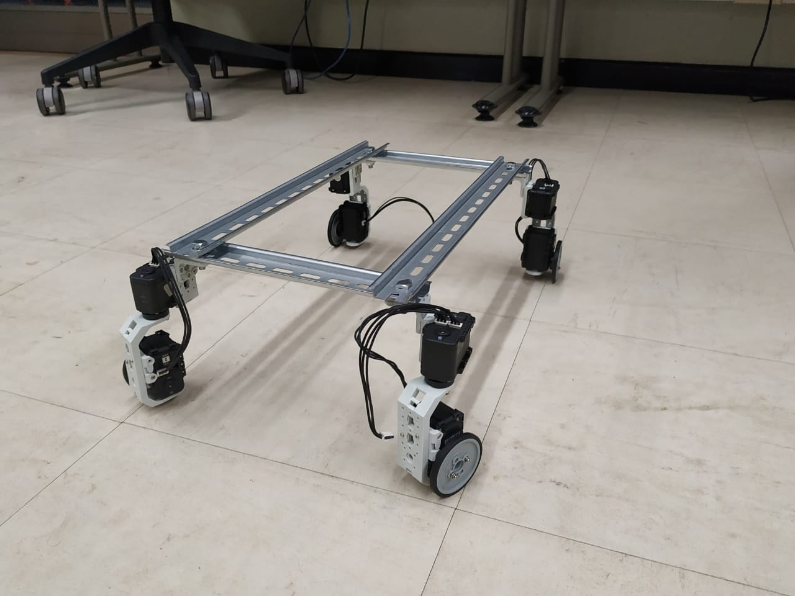

# Tadeo Car
## Robótica industrial
Con este proyecto se busca diseñar un modelo a escala de un vehículo de tracción de cuatro ruedas utilizando servomotores [Dynamixel](http://www.dynamixel.com).
### Construccción
Se hizo la estructura con riel DIN sobre el que se pusieron los servomotores:


### URDF
Se modeló el robot utilzando URDF dentro del entorno de ROS


Del cual se generó la cadena cinemática


### Circuito
Se diseñó el circuito utilizando Proteus;


### Código
Se programaron los servomotores utilizando [Arduino](https://www.arduino.cc)

```
/**
 * Calcula la velocidad que debe tener cada rueda
*/
void computeVel()
```
